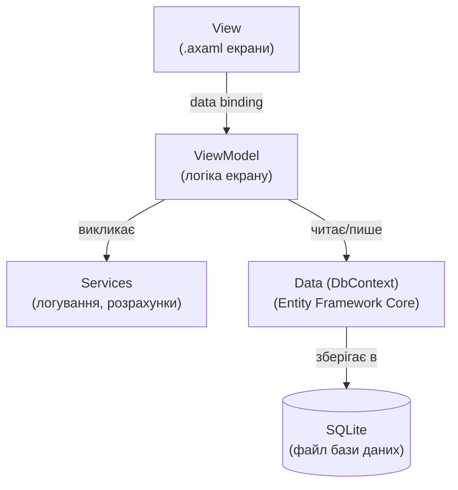
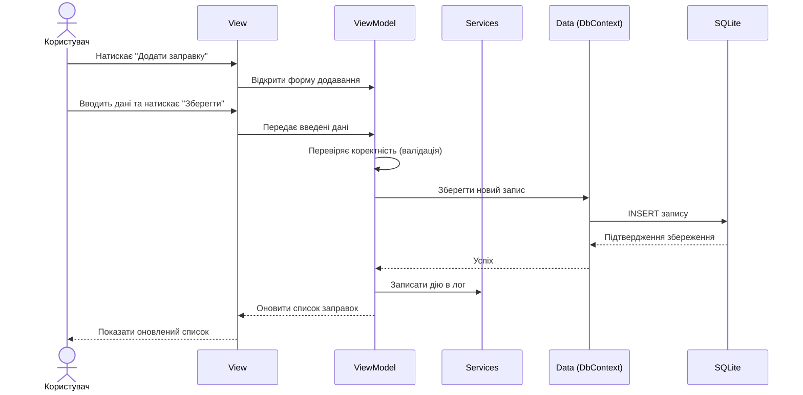
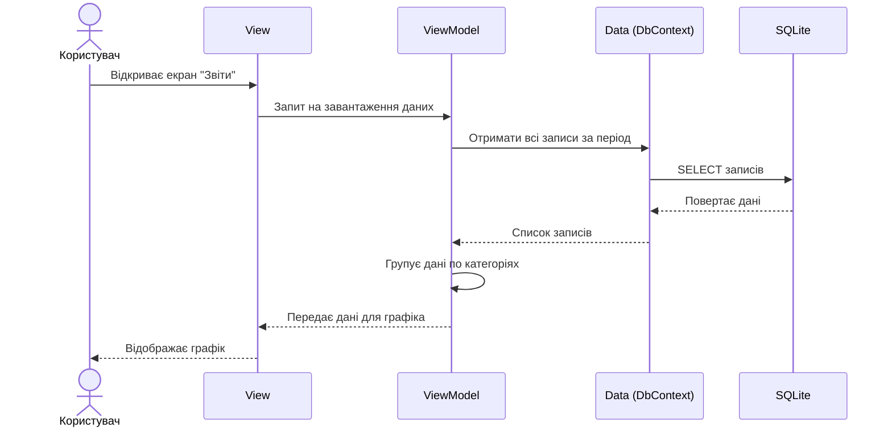

UML: діаграма компонентів та архітектури

Застосунок побудований за архітектурним патерном MVVM (Model-View-ViewModel), 
що розділяє інтерфейс, логіку взаємодії та дані на окремі шари.

Опис компонентів

View — відповідає лише за відображення інтерфейсу (кнопки, таблиці, 
форми). Не містить бізнес-логіки.

ViewModel — містить логіку конкретного екрана: обробляє дії користувача, 
готує дані для відображення, звертається до Services та Data.

Services — допоміжна логіка, що не належить конкретному екрану: 
журналювання дій, розрахунки (наприклад, витрата пального л/100км).

Data (DbContext) — шар доступу до бази даних через Entity Framework 
Core: збереження, читання, оновлення та видалення записів.

SQLite — файлова база даних, у якій фізично зберігаються всі дані 
застосунку локально на пристрої користувача.

Схема основних потоків взаємодії

Сценарій: додавання нового запису (наприклад, заправки)

Сценарій: перегляд графіка витрат

